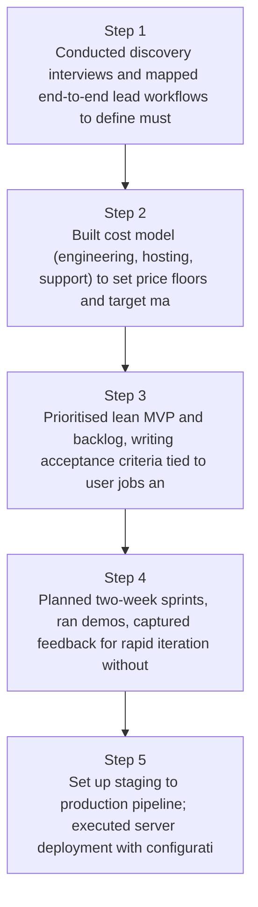
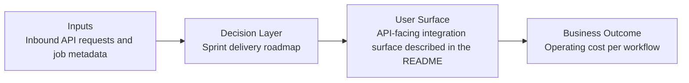
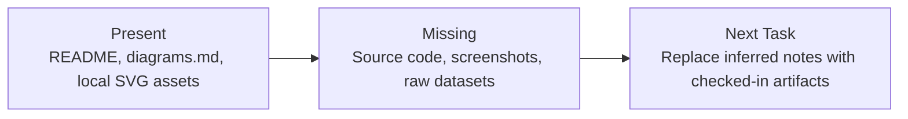

# Lead Management Product Launch Diagrams

Generated on 2026-04-26T04:29:37Z from README narrative plus project blueprint requirements.

## Product launch timeline

## Sprint delivery roadmap

## Evidence Gap Map

